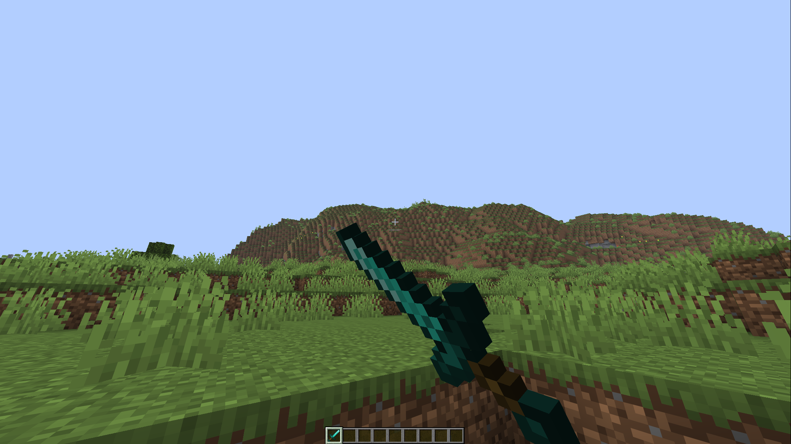
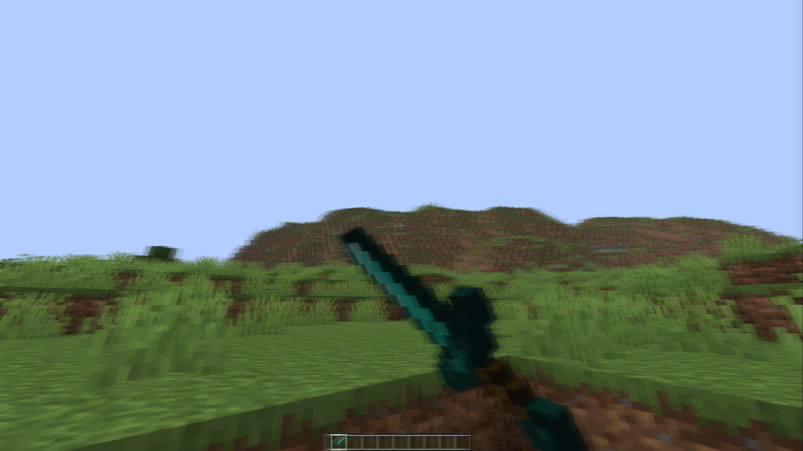

  

<h1 align="center">LunaBlur</h1>

  <a href="https://modrinth.com/project/lunablur">Modrinth</a>
  |
  <a href="https://github.com/kaanreal/lunablur">GitHub</a>
  |
  <a href="https://github.com/kaanreal/lunablur/issues">Issues</a>

## Overview

LunaBlur adds a lightweight fullscreen motion blur effect without going for the heavier cinematic style some other blur mods use. The goal is simple: keep the game feeling smoother in motion while staying easy to use and easy to drop into a normal Fabric setup.

## Motion Blur examples:

| Without | With |
| --- | --- |
|  |  |

## Why LunaBlur

I took inspiration of this <a href="https://modrinth.com/mod/motionblur">Mod</a> from <a href="https://github.com/Noryea">Noryea</a> and made it for 1.21.11

## Installation

Put these mods in your `mods` folder:

- `lunablur-1.0.0+mc1.21.11.jar`
- Fabric API
- Cloth Config

Optional:

- Mod Menu

## Usage

Commands:

- `/lunablur` opens the config menu
- `/lunablur <0-100>` sets blur strength

Default keybinds:

- `B` opens the config menu
- `H` toggles blur on or off

## Requirements

- Minecraft `1.21.11`
- Fabric Loader `0.18.1+`
- Fabric API `0.141.1+1.21.11`
- Cloth Config `21.11.153+fabric`
- Java `21`

Optional:

- Mod Menu `17.0.0`

## Project Info

- Version: `1.0.0+mc1.21.11`
- Environment: client-side only
- License: MIT
